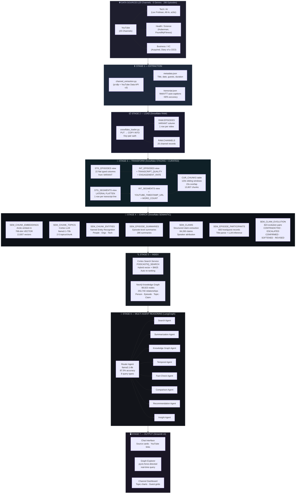
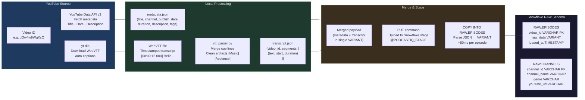
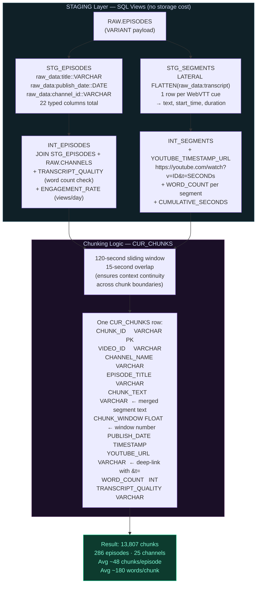
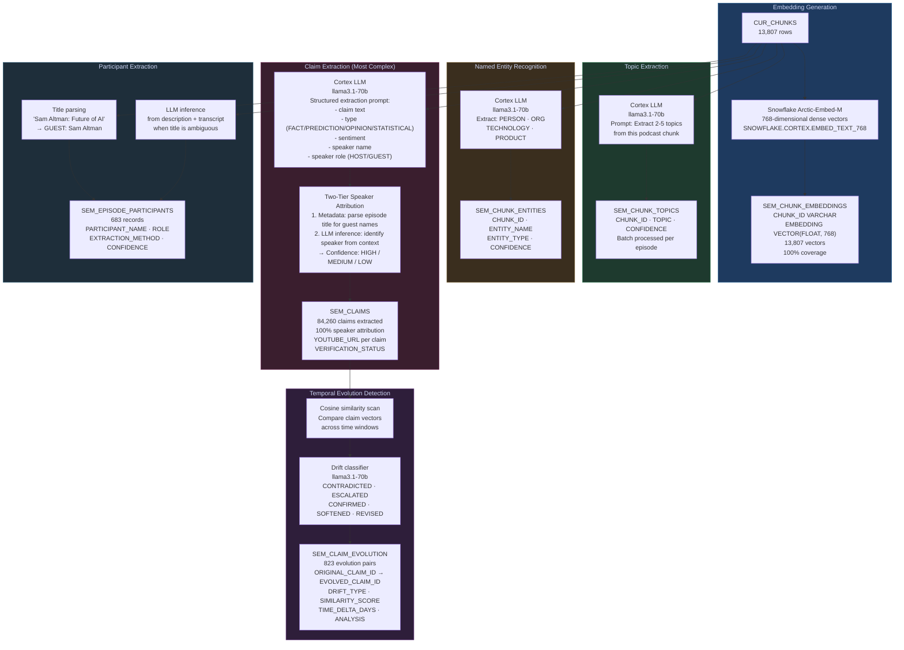
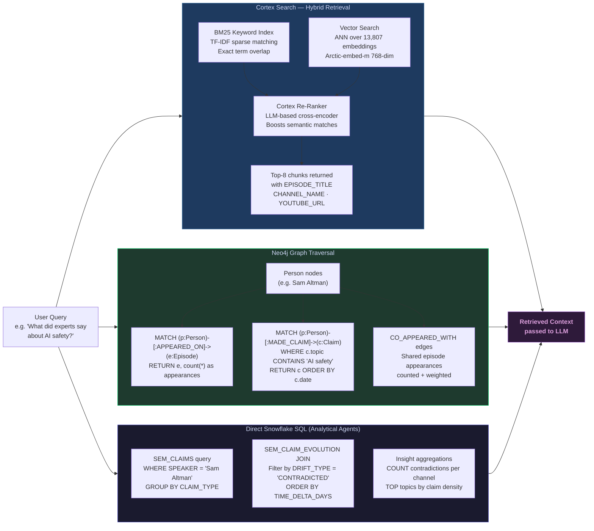
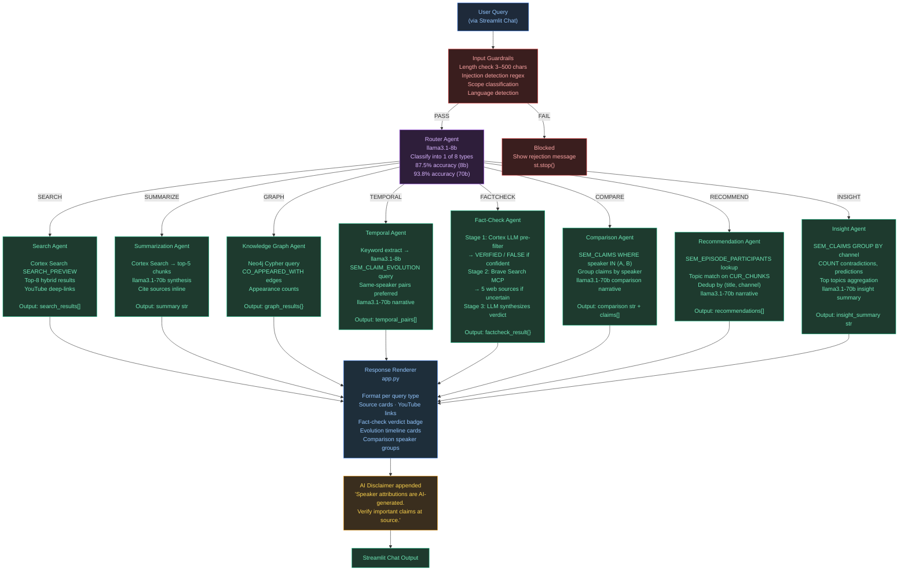
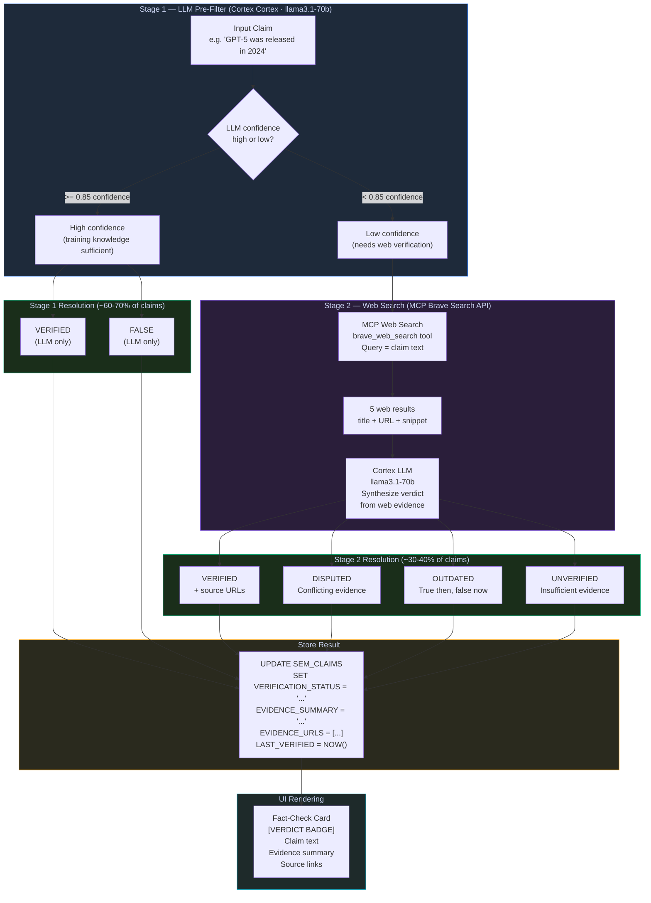
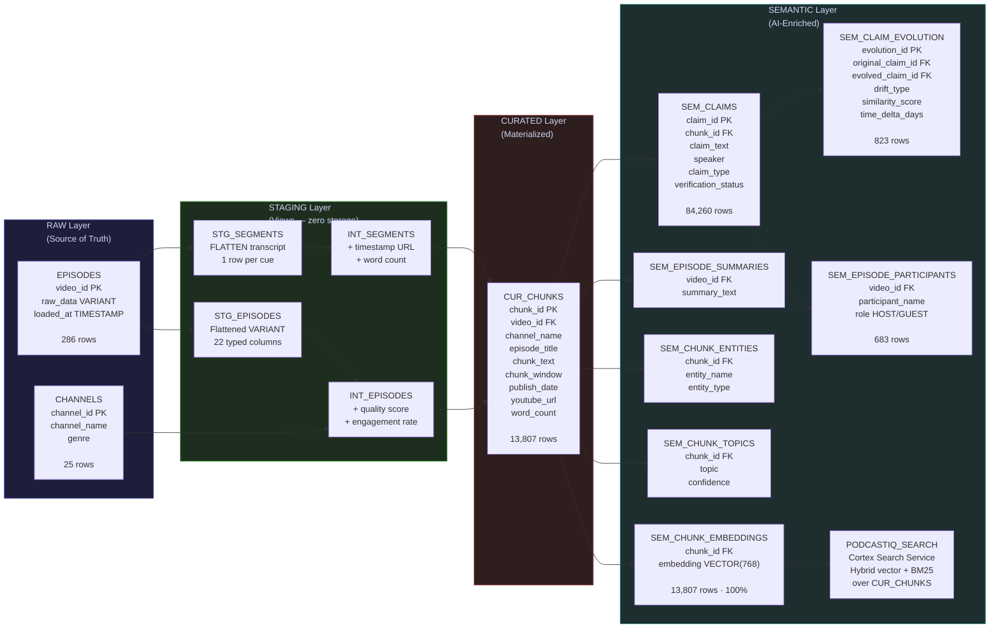
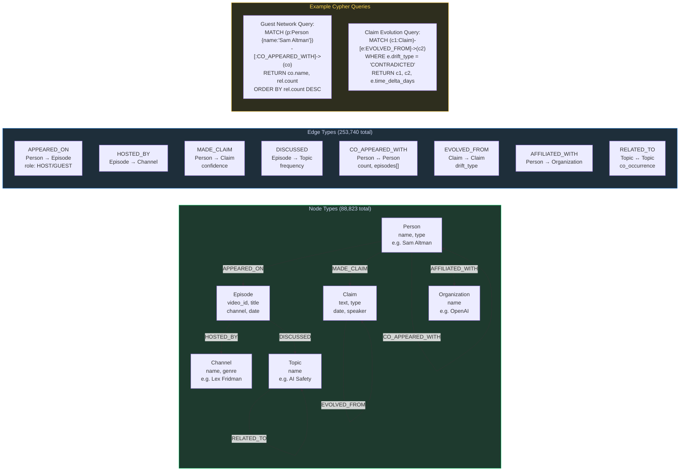
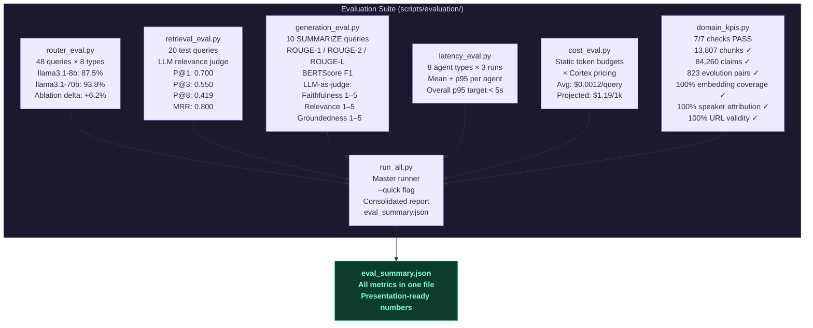

# PodcastIQ — Data Flow Diagrams

> Comprehensive diagrams covering every stage of the PodcastIQ pipeline:
> Extraction → Transformation → Embedding → Retrieval → Generation → Output

---

## Diagram 1 — End-to-End System Overview

---

## Diagram 2 — Detailed Extraction & Ingestion Pipeline

---

## Diagram 3 — Transformation & Chunking Pipeline

---

## Diagram 4 — Semantic Enrichment Pipeline

---

## Diagram 5 — Hybrid Retrieval Architecture

---

## Diagram 6 — LangGraph Multi-Agent Routing Flow

---

## Diagram 7 — Fact-Checking Data Flow (Two-Stage Pipeline)

---

## Diagram 8 — Snowflake 4-Layer Schema Architecture

---

## Diagram 9 — Neo4j Knowledge Graph Schema

---

## Diagram 10 — Evaluation Framework

---

## Quick Reference — Data Volumes

| Stage | Table / Object | Rows / Size |
|-------|---------------|-------------|
| Extraction | YouTube transcripts | 286 episodes · 25 channels · 6 genres |
| Raw | `RAW.EPISODES` | 286 VARIANT rows |
| Curated | `CUR_CHUNKS` | **13,807 chunks** (120s windows) |
| Embeddings | `SEM_CHUNK_EMBEDDINGS` | **13,807 × 768-dim vectors** |
| Claims | `SEM_CLAIMS` | **84,260 claims** (100% speaker-attributed) |
| Evolution | `SEM_CLAIM_EVOLUTION` | **823 pairs** (CONTRADICTED · ESCALATED · CONFIRMED · SOFTENED · REVISED) |
| Participants | `SEM_EPISODE_PARTICIPANTS` | 683 host/guest records |
| Knowledge Graph | Neo4j | **88,823 nodes · 253,740 relationships** |
| Search Index | Cortex Search `PODCASTIQ_SEARCH` | Hybrid BM25 + vector over 13,807 chunks |
| Temporal coverage | Jan 2022 → Feb 2026 | **44 months** |

## Quick Reference — Model Usage

| Agent / Step | Model | Purpose |
|---|---|---|
| Router | `llama3.1-8b` | Query classification (8 types) |
| Embedding | `Arctic-embed-m` | 768-dim dense vectors |
| Retrieval re-ranking | Cortex Search built-in | Hybrid BM25 + vector re-rank |
| Summarization | `llama3.1-70b` | Synthesis from retrieved chunks |
| Comparison | `llama3.1-70b` | Cross-speaker claim analysis |
| Temporal | `llama3.1-70b` | Evolution narrative generation |
| Fact-check (Stage 1) | `llama3.1-70b` | Pre-filter from training knowledge |
| Fact-check (Stage 2) | Brave Search MCP + `llama3.1-70b` | Web retrieval + verdict synthesis |
| Insight | `llama3.1-70b` | Meta-analysis narrative |
| Claim extraction | `llama3.1-70b` | Structured claim + speaker extraction |
| LLM judge (eval) | `llama3.1-70b` | Faithfulness / Relevance / Groundedness |
